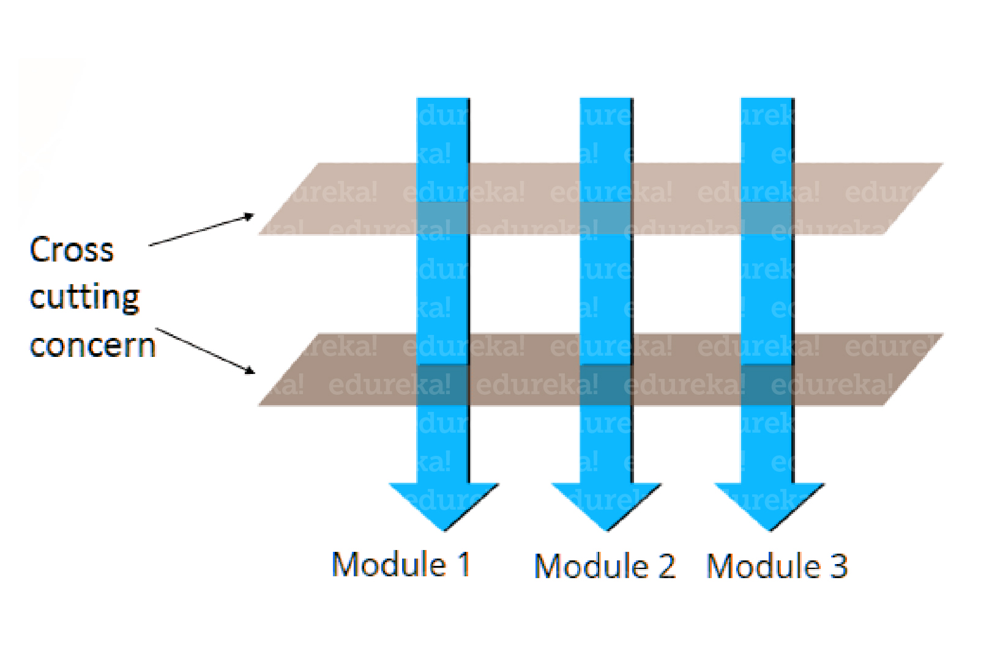
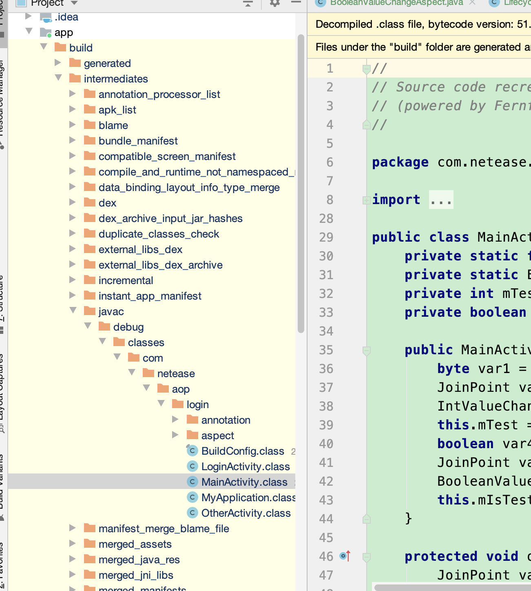

# Hook编程

## AOP(面相切面编程)

与oop不同的地方是,oop一般是站在业务模块的角度解决问题(订单,广告),aop是面对同一类问题(日志打印,生命周期监控等等)

### 好处

对逻辑隔离,降低耦合性

### 原理

通过语法匹配方式,在预编译阶段进行的代码改变

### 用处

日志记录，性能统计，安全控制，事务处理，异常处理等等。

### 缺点

需要同事之间做好沟通,否则出现问题不好排查

### 应用框架

AspectJ

https://github.com/HujiangTechnology/gradle_plugin_android_aspectjx

### 语法

#### 1.JoinPoint

JoinPoint: A particular point in a program that might be the target of code injection.
JoinPoint 简单一点说就是程序运行时要执行一些动作的点。

#### 2.Pointcut

Pointcut: An expression which tell a code injection tool where to inject a particular piece of code
Pointcut 简单的说就是从一堆的 JoinPoint 中挑选感兴趣的 JoinPoint 的表达式。

#### 3.Advice

Advice: Advice defines pieces of aspect implementation that execute at well-defined points in the execution of the program.

通过前面的 Pointcuts 找到了相应的 JointPoint, 需要对这些 JointPoint 最一些事情，相当于对 JointPoint 进行 hook, 这就是 advice 要做的事。

### 推荐阅读

https://blog.csdn.net/innost/article/details/49387395

[http://www.yxhuang.com/2019/06/29/AspectJ%E5%9C%A8Android%E4%B8%AD%E7%9A%84%E4%BD%BF%E7%94%A8/](http://www.yxhuang.com/2019/06/29/AspectJ在Android中的使用/)