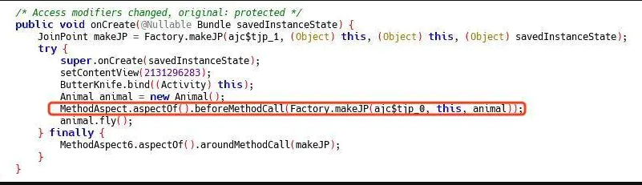

# Hook编程

## AOP(面相切面编程)

与oop不同的地方是,oop一般是站在业务模块的角度解决问题(订单,广告),aop是面对同一类问题(日志打印,生命周期监控等等)

### 好处

对逻辑隔离,降低耦合性

### 原理

通过语法匹配方式,在预编译阶段进行的代码改变

### 用处

日志记录，性能统计，安全控制，事务处理，异常处理等等。

### 缺点

需要同事之间做好沟通,否则出现问题不好排查

### 应用框架

AspectJ

https://github.com/HujiangTechnology/gradle_plugin_android_aspectjx

### 推荐阅读

https://blog.csdn.net/innost/article/details/49387395

[http://www.yxhuang.com/2019/06/29/AspectJ%E5%9C%A8Android%E4%B8%AD%E7%9A%84%E4%BD%BF%E7%94%A8/](http://www.yxhuang.com/2019/06/29/AspectJ在Android中的使用/)